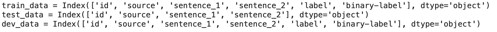
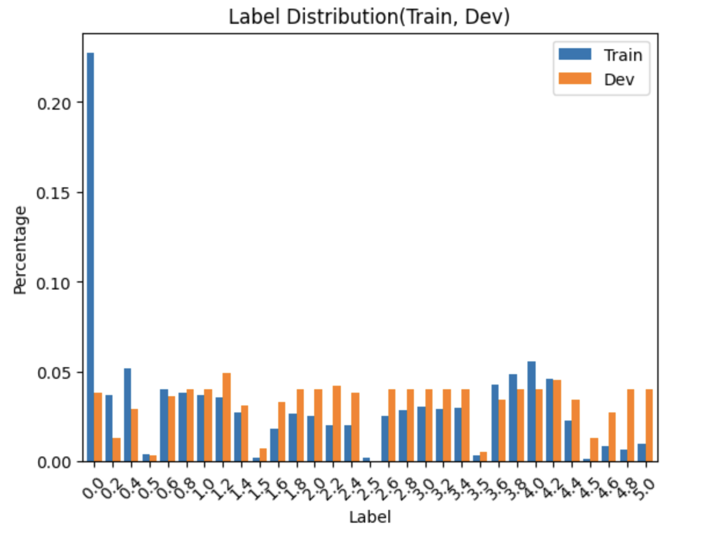
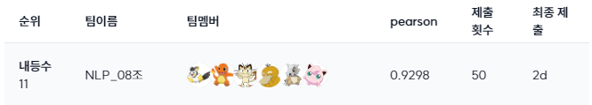
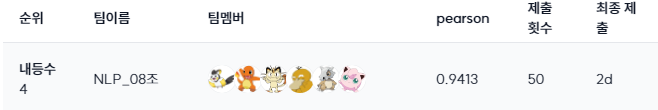

# 🔥 네이버 AI Tech NLP 8조 The AIluminator 🌟
## Level 1 Project - Semantic Text Similarity (STS)

## 목차
1. [프로젝트 소개](#1-프로젝트-소개)
2. [프로젝트 구조](#2-프로젝트-구조)
3. [Installation and Quick Start](#3-installation-and-quick-start)
4. [팀원 소개](#4-팀원-소개)
5. [프로젝트 진행](#5-프로젝트-진행)
6. [리더보드 결과](#6-리더보드-결과)

## 1. 프로젝트 소개
(1) 주제 및 목표
- 부스트캠프 AI Tech NLP 트랙 level 1 기초 대회
- 주제 : 문장 간 유사도 측정 (Semantic Text Similarity, STS)    
      STS 데이터셋을 활용해 두 문장의 유사도를 0 ~ 5 사이의 점수로 예측  <br>

(2) 평가지표
- 피어슨 상관 계수(Pearson Correlation Coefficient ,PCC) <br>

(3) 개발 환경 <br>
- GPU : Tesla V100 * 4 <br>

(4) 협업 환경
- 노션 - 팀 노션 페이지에 해야할 일, 상황 공유    
- 슬랙 - 허들, DM을 활용해 팀원 간 실시간 소통   
- 깃허브 - 코드 공유

## 2. 프로젝트 구조
```sh
.
├── model
│   ├── fine_tune_gnn.py
│   ├── fine_tune_sts.py
│   └── SimCSE.py
├── preprocessing
│   ├── modeling
│   │   └── Clustering.ipynb
│   ├── DataCleaning.ipynb
│   ├── EDA.ipynb
│   ├── v1_downsampling.ipynb
│   ├── v2_augmentation_biassed.ipynb
│   ├── v3_augmentation_uniform.ipynb
│   └── v4_augmentation_spellcheck.ipynb
├── resources
│   ├── log
│   └── raw
│       ├── dev.csv
│       ├── sample_submission.csv
│       ├── test.csv
│       └── train.csv
├── utils
│   ├── data_module.py
│   ├── ensemble_module.py
│   └── helpers.py
├── inference.py
├── run_ensemble.py
├── train_graph.py
├── train.py
├── train_unsup_CL.py
```

## 3. Installation and Quick Start

**Step 1.** 해당 repository를 clone해서 사용

**Step 2.** 프로젝트에 필요한 모든 dependencies는 `requirements.txt`에 있고, 이에 대한 가상환경을 생성해서 프로젝트를 실행
```sh
$ python -m venv .venv
$ pip install --upgrade pip
$ pip install -r requirements.txt
```
**Step 3.** `preprocessing` 폴더에서 원하는 전처리 작업 진행하여 데이터 가공

**Step 4.** 본인의 가상환경에서 Training 수행
```sh
$ . .venv/bin/activate
$ wandb login # init set up : 본인의 wandb 계정을 한번 로그인 해두면 그 다음부터는 실행 안해도 됩니다.

# 다양한 데이터로 학습
$ python train.py

# (Optional) Contrastive Learning 수행
$ python train_unsup_CL.py
```

**Step 5.** 본인의 가상환경에서 Inference 수행
```sh
$ . .venv/bin/activate

# 단일 모델 Inference
$ python inference.py

# 다양한 모델 앙상블
$ python run_ensemble.py

```

**Optional.** 원격 연결 끊어졌을 때도 돌아갈 수 있도록 Tmux 사용을 권장
```sh
# 새로운 세션 생성
$ tmux new -s (session_name)

# 세션 목록
$ tmux ls

# 세션 시작하기 (다시 불러오기)
tmux attach -t (session_name)

# 세션에서 나가기
(ctrl + b) d

# 특정 세션 강제 종료
$ tmux kill-session -t (session_name)
```


## 4. 팀원 소개
|김동한|김성훈|김수아|김현욱|송수빈|신수환|
|:--:|:--:|:--:|:--:|:--:|:--:|
|||||||
<!-- |[Github]()|[Github]()|[Github](https://github.com/tndkkim)|[Github](https://github.com/hwk9764)|[Github](https://github.com/suvinn)|[Github]()| -->

### 맡은 역할
|**Member**|**Team**|**Role**|
|:--|--|--|
|**김수아**|Data|**EDA**(label 분포 및 문장 길이 분석), **Data Cleanling**|
|**김현욱**|Data|**EDA**(label 분포 분석), **데이터 증강**(Sentence Swap/Adverb Augmentation/BERT-Mask Insertion)|
|**송수빈**|Data|**데이터 증강**(Downsampling/Sentence Swap/BERT-Mask Insertion/hanspell)|
|**김동한**|Model|**Modeling**(Soft Voting Ensemble),**Model Tuning**(snumin44/simcse-ko-roberta-supervised, sorryhyun/sentence-embedding-klue-large)|
|**김성훈**|Model|**Model Exploration & Training**, **Modeling**(Second-stream with GNN, Contrastive Learning, Soft Voting Ensemble), **Model Tuning**(deliciouscat/kf-deberta-base-cross-sts, snunlp/KR-ELECTRA-discriminator), **코드 모듈화**|
|**신수환**|Model|**Model Training & Tuning**(RoBERTa, T5, SBERT), **모델 경량화**(Roberta-large with deepspeed), **Modeling**(Clustering)|
<br>

## 5. 프로젝트 진행
| Task | **Task Description** |
| --- | --- |
| **EDA** | 데이터의 특성을 살펴보기 위해 label별 분포 등 시각화 및 분석 |
| **Augmentation** | 데이터셋의 불균형성을 해소하기 위해 다양한 방법으로 데이터 증강 수행 |
| **Model Exploration** | 데이터셋과 STS  task를 수행하기 적합한 pre-trained model 선정 |
| Second-stream with GNN | 단어들 사이의 유의어 관계를 모델링하기 위해 Graph Neural Networks (GNN)을 second-stream으로 NLP 모델에 통합하고 성능 평가 / 최종 제출 때는 사용 x |
| **Contrastive Learning** |  STS Task에서 SOTA의 성능을 달성했던 Contrastive Learning을 본 프로젝트에 적용하여 성능 평가 |
| Clustering | 문장 사이의 코사인 유사도를 바탕으로 라벨관의 상관관계를 탐구하여 모델에의 활용 방안 및 전처리 방법 고안 / 최종 제출 때는 사용 x|
| **Soft Voting Ensemble** | 증강된 데이터셋으로 학습한 다양한 model의 예측확률을 평균하여 여러 모델의 강점을 결합해 성능 향상 |


### 사용한 데이터셋
데이터는 train.csv / dev.csv / test.csv의 3개의 파일로 되어있으며 각 파일의 column은 다음과 같이 구성되어있다. <br>
  

**id** : 문장 고유 id <br>
**source** : 문장 출처 <br>
**sentence_1, sentence_2** : 유사성을 비교할 두 문장 <br>
**label** : 문장 쌍의 유사도. 0~5점 사이 값으로 소수점 첫째 자리까지 표현됨 <br>
**binary-label** : label 2.5점을 기준으로 0과 1로 변환한 값 <br>

### 데이터 분포
train data의 경우 label 0.0에 데이터가 쏠린 반면 dev data의 경우 비교적 균등하게 데이터가 분포되어있음을 알 수 있다. <br>
 <br>
train data의 불균형을 해소하기 위해 label 0.0에 해당하는 데이터 수를 줄이고 여러 증강 기법들을을 활용하였다. <br>
<br>

### 데이터 증강
|**Version**|**Abstract**|**num**|
|:--:|--|:--:|
|**V1_Downsampling**|label 0.0 데이터 1000개 downsampling|8,324|
|**V2_augmentation_biased**|`AugmentationV1` + `BERT-Token Insertion`|9,994|
|**V3_augmentation_uniform**|`AugmentationV2` + `Adverb Augmentation` + `Sentence Swap` + `BERT-Token Insertion`|15,541|
|**V4_augmentation_spellcheck**|`AugmentationV2` + `hanspell` + `Sentence Swap` |17,313|

### 증강 데이터 버전 설명
|**Version**|**Description**|
|:--:|--|
|**V1_Downsampling** |Downsampling된 1000개의 문장으로 V2에서 (4.0, 5.0] label의 data augmentation을 진행할 것이기 때문에, label이 0.0인 데이터셋에서 문장 내 token 수가 3개 이상이면서, K-TACC 증강 방법 중 random_masking_insertion을 진행했을 때 증강이 되는 문장을 선별했습니다. sentence_1과 sentence_2 모두 증강된 index만 고려하면서, sentence_1을 기준으로 유사도가 높은 상위 1000개의 index를 선별했습니다. 문장 간 유사도가 고려되지 못한 sentence_2 데이터셋에 대해서는 추후 data filtering을 거쳤습니다.|
|**V2_augmentation_biassed**|V1에서 Downsampling된 1000개 데이터셋을 증강한 데이터셋 중에서도 label이 5.0인 데이터셋은 큰 차이가 없어야 한다고 판단하여, 불용어를 제거하면 같은 문장인 데이터를 label 5.0에 할당했습니다. label이 (4.0, 5.0)인 데이터셋은 라벨 간의 비율을 직접 조정하면서, 유사도가 높은 순서대로 개수에 맞게 할당했습니다.|
|**V3_augmentation_uniform**| label 분포를 균형있게 맞추어 전체적인 데이터 분포를 고르게 하기 위해 **라벨별 증강 비율을 조정**하여 총 3단계에 걸쳐 증강했고 매 단계마다 데이터의 개수가 적은 label들을 집중적으로 증강했습니다. <br> 1단계로 label이 `0.5, 1.5, 1.6, 2.2, 2.4, 2.5, 3.5` 데이터에 대해 Adverb Augmentation 수행했습니다. 2단계로 label이 `0.5, 0.6, 0.8, 1.0, 1.2, 1.4, 1.8, 2.6, 2.8, 3, 3.2, 3.4, 3.5` 데이터에 대해 Sentence Swap 수행하였습니다. 3단계로 `1.5, 2.5, 3.5` 데이터에 대해 random_masking_insertion을 수행하였으며 추가로 `1.5, 2.5` 데이터 중 Masking Insertion한 증강 데이터에 대해 Sentence Swap을 수행했습니다.|
|**V4_augmentation_spellcheck**|label이 0.0인 데이터셋 중 맞춤법 교정 라이브러리 hanspell이 sentence_1과 sentence_2 모두에 적용된 index 776개를 뽑고, 증강된 데이터셋들을 label 4.8에 493개, label 5.0에 1059개 할당하였습니다. label이 (0.0, 4.4]인 데이터셋은 sentence swapping을 진행하였습니다. V2의 데이터셋 중 500개를 뽑아와 label 4.6에 450개, 4.5에 50개 할당하여 라벨 간 비율이 비숫해지도록 조정하였습니다.|


### 증강 데이터 분포
**V1_Downsampling**
|||
|:--:|:--:|
|label 별 분포|0.5단위 구간 별 분포|
<br>

**V2_augmentation_biased**
|||
|:--:|:--:|
|label 별 분포|0.5단위 구간 별 분포|
<br>

**V3_augmentation_uniform**
|||
|:--:|:--:|
|label 별 분포|0.5단위 구간 별 분포|
<br>

**V4_augmentation_spellcheck**
|||
|:--:|:--:|
|label 별 분포|0.5단위 구간 별 분포|
<br>

### Model Exploration
한국어 데이터셋에 적합한 pre-trained model을 탐색하기 위해 대회에서 준 데이터를 가공하지 않고 그대로 사용하여 성능을 평가하고, 이를 base 모델로 하여 STS 성능을 극대화하는 방향으로 진행

Hugging Face의 모델 허브에서 `semantic text similarity` tag로 필터링한 후 Transformer 기반의 한국어 모델들(e.g. simcse-ko-bert, klue-roberta, kf-deberta, …) 에 대해 성능 평가 진행

서버의 HW 환경을 고려한 효율적인 학습 및 추론을 위해 LLM보다 가벼운 Encoder 기반 모델 선정

| Model | Valid Pearson | Public Pearson |
| --- | --- | --- |
| jhgan/ko-sbert-sts | 0.882 | 0.872 |
| snumin44/simcse-ko-bert-supervised | 0.880 | 0.880|
| upskyy/kf-deberta-multitask | 0.920 | 0.909 |
| deliciouscat/kf-deberta-base-cross-sts | 0.929 | **0.911** |
| sorryhyun/sentence-embedding-klue-large | 0.912 | **0.910** |
| ddobokki/klue-roberta-small-nli-sts | 0.881 | 0.867 |

### Second-stream with GNN
**모델링 설명**
- STS(Semantic Textual Similarity) 문제에서 단어 사이의 유사도는 중요한 factor라는 가설을 세워 실험을 진행
- (1) Model Exploration을 통해 탐색된 Transformer 기반의 모델을 통해 입력으로 들어가는 문장의 context representation을 학습하고, (2) GCN을 통해 단어들 간의 유사도로 구축된 Graph representation을 학습
- 두가지의 representation을 dot product 하고 나오는 representation을 MLP 레이어의 input으로 사용하여 문장 쌍에 대한 0~5점 사이의 유사도를 예측

**결과 분석**
- 정량적 평가 : 제안하는 모델이 기존 backbone의 성능보다 더 좋은 것을 확인하였으나, 모델 학습의 cost가 커지는 것 대비 성능의 차이가 미미한 것으로 판단됨
- 정성적 평가 : 실제 데이터 예측 결과를 확인해본 결과 `주택가`와 `주거지역`이라는 유사한 단어가 존재하는 경우 반영하여 더 높은 점수를 부여하는 것을 확인
- 사전 그래프 구축 작업의 정교함에 따라 성능의 폭이 커질 것으로 예상되어 마지막 제출 전 시간이 남으면 진행할 것으로 결론냄

| Model | Validation Pearson | Public Pearson |
| --- | --- | --- |
| deliciouscat/kf-deberta-base-cross-sts | 0.926 | 0.9110 |
| deliciouscat/kf-deberta-base-cross-sts + GNN | 0.929 | 0.9164 |

### Contrastive Learning
**모델링 설명**
- SimCSE (Gao et al., 2021)은 Contrastive Learning을 sentence embedding에 적용한 최초의 논문으로 그 해 STS Task에서 SOTA의 성능을 달성
- Contrastive Learning이 negative instance를 분리하므로 uniformity를 향상시켜 anisotropy를 완화 시키는 것을 실험적으로 증명하였고, 이 요소들이 sentence embedding에 중요한 factor임을 확인
- 이에 SimCSE의 Contrastive Learning을 본 프로젝트의 적용하고자 하였으며, 시간 관계 상 Unsupervised SimCSE를 적용하였음

**결과 분석**
- 정량적 평가 : Validation Pearson 기준으로는 Second-stream with GNN과 동일하지만 Public Pearson 결과는 더 향상된 것을 확인
- 정성적 평가 : deberta with CL 모델은 5.0이상으로 라벨을 예측하는 경우가 84개 더 많은 것을 확인할 수 있음, 이를 통해 Contrastive Learning이 효과적으로 적용되어 보다 잘 분류하는 것을 확인 
- 학습 cost와 성능 향상 폭을 생각했을 때는 Contrastive Learning이 유의미한 것으로 판단되어 제안하는 모델을 사용하는 것으로 결정

| Model | Validation Pearson | Public Pearson |
| --- | --- | --- |
| deliciouscat/kf-deberta-base-cross-sts | 0.926 | 0.9110 |
| deliciouscat/kf-deberta-base-cross-sts + GNN | 0.929 | 0.9164 |
| deliciouscat/kf-deberta-base-cross-sts + CL | 0.929 | 0.9190 |

### Clustering
**모델링 설명**
- STS(Semantic Textual Similarity) 문제에서 모델은 (1) 두 벡터의 코사인 유사도 값이 크나 문장 간의 label이 작은 경우나 (2) 코사인 유사도 값이 작으나 문장간의 label이 큰 경우에 대해 어려워 할 것이라고 가정
- 이러한 문제들을 잘 해결할 수 있도록 위 두가지 케이스를 고려한 클러스터를 만들어 모델을 학습하고자 함
- `train.csv`의 `sentence_1`, `sentence_2` 를 사전 학습된 encoder 모델로 임베딩 후, 각 임베딩 벡터 간의 코사인 유사도를 계산하고 label과 코사인 유사도 간 상관관계를 기준으로 두개의 클러스터로 분류

**결과 분석**
- 정량적 평가 : Public Pearson 측정 결과, 0.9177의 성능을 확인
- 정성적 평가 : 맞춤법, 불용어 등에 따라 코사인 유사도의 영향을 많이 받는 것을 확인하여 Cleaning 전처리를 추가하기로 결정

### Soft Voting Ensemble
**모델링 설명**
- Soft Voting은 앙상블 학습에서 사용되는 기법으로, 여러 개의 분류 모델의 예측 결과를 평균하여 최종 예측을 만드는 방법
- 각 모델이 예측한 logit을 평균하거나 가중 평균하여 최종 logit 결정
- Valid score 기반 가중 평균
    - 앙상블할 모델의 valid score만큼 비율로 곱하여 가중 평균
    - e.g) model A : 0.9 / model B : 0.8 인 경우
        
        $$
        \frac {A_i \times0.9+B_i\times 0.8} {0.9+0.8}
        $$
        
- Min-Max 정규화 가중 평균
    - 단순 Valid score 기반 가중 평균시, 대부분의 앙상블 대상 모델이 92~93의 유사한 valid score를 가짐
    - 더 좋은 성능을 가진 모델과 그렇지 않은 모델간 차이를 줄 수 있게 적합한 가중치 정규화의 필요성을 느낌
    - 앙상블할 모델의 valid score를 0.8~1.2 값으로 scaling하여 가중평균
    - 0.8~1.2로 scaling할때의 min-max 정규화 수식

$$
0.8+\frac {x-x_{min}} {x_{max}-x_{min}}\times(1.2-0.8)
$$


**결과 분석**
- Data Aaugmentation 진행한 결과에 따른 4가지 version의 train data와 Model exploration&Modeling을 거쳐 선정된 model에 다양한 조합으로 실험하여 최적의 성능 도출
- **각 기법마다 best case에 대해서 비교해본 결과 min-max 평균을 취한 case가 가장 높은 92.98의 public pearson 값을 가지는 것을 확인하고 이를 최종 리더보드에 제출**

| 모델 | 활용 기법 | Validation Pearson | Min-Max 정규화 가중 평균 |
| --- | --- | --- | --- |
| deliciouscat/kf-deberta-base-cross-sts | raw + Contrastive Learning | 0.930 | 1.111 |
| deliciouscat/kf-deberta-base-cross-sts | raw + Cleaning | 0.930 | 1.111 |
| sorryhyun/sentence-embedding-klue-large | Augmentation v2 | 0.923 | 0.800 |
| snunlp/KR-ELECTRA-discriminator | Augmentation v2 | 0.932 | 1.200 |
| snunlp/KR-ELECTRA-discriminator | Augmentation v3 | 0.930 | 1.111 |

## 6. 리더보드 결과
Leader Board에서 Pearson을 비교하였을 때 0.105가 올라, 대회에 참여한 16팀 중 가장 많이 순위가 상승하였고 최종 4위를 기록함

**Public Leader Board 순위**




**Private Leader Board 순위**

